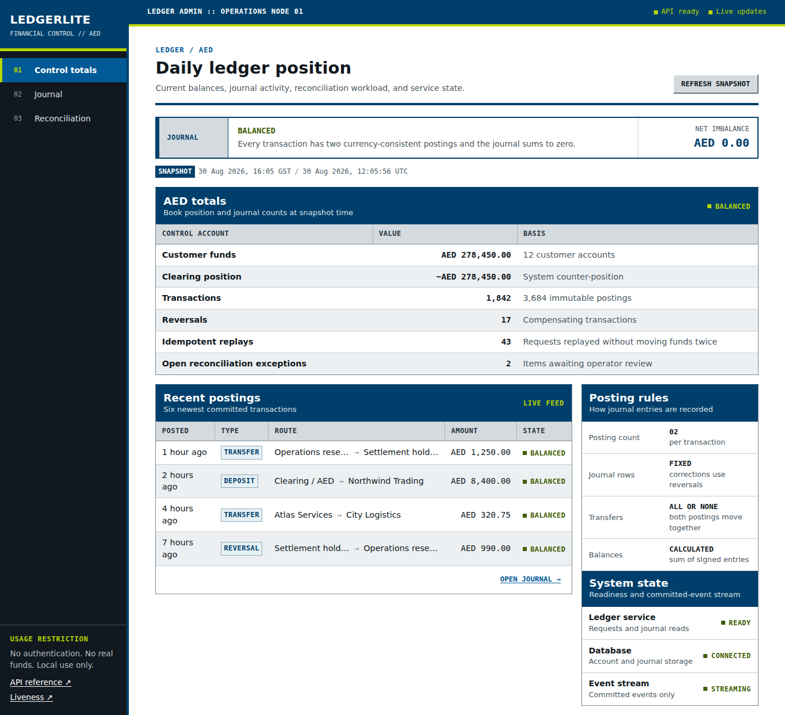

# LedgerLite

LedgerLite is a local administration console for an AED double-entry
ledger. It provides account statements, transaction inspection, compensating
reversals, settlement reconciliation, and live journal updates.



> [!WARNING]
> LedgerLite has no authentication, authorization, tenancy, or account-ownership
> controls. Run it only on your own machine, do not use real financial data, and
> do not expose it to the internet.

## Run locally

Install Docker with Docker Compose, then run:

```bash
docker compose up --build
```

Open [http://127.0.0.1:8000](http://127.0.0.1:8000).

Stop the application without deleting its data:

```bash
docker compose down
```

To discard the local data and start again:

```bash
docker compose down --volumes
docker compose up --build
```

## Using the console

- **Control totals** shows customer funds, the clearing position, journal counts,
  open reconciliation exceptions, and service state.
- **Journal** filters transactions and accounts. Open a transaction to inspect its
  signed postings or create an eligible reversal. Open an account for its statement.
- **Reconciliation** compares processor records with ledger transactions and lets
  an operator match or ignore unresolved items without changing the journal.

## Ledger rules

Every financial transaction contains two signed entries in one currency whose
sum is zero. Account balances are calculated from those entries. Posted rows are
not edited; a correction creates an equal and opposite transaction linked to the
original.

Money-moving requests accept an idempotency key so retrying the same request does
not move funds twice. Transfers lock participating accounts before checking the
available balance.

LedgerLite does not connect to payment rails or implement identity, access control,
KYC, AML, fraud detection, fees, or FX.
